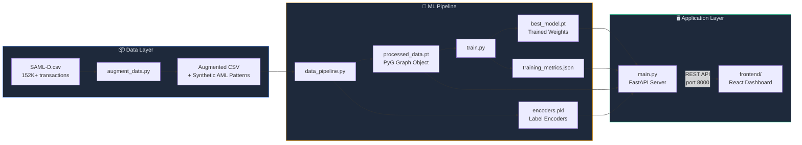
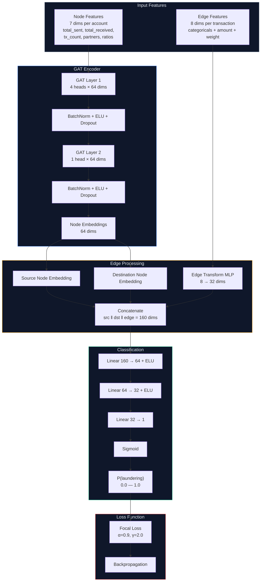
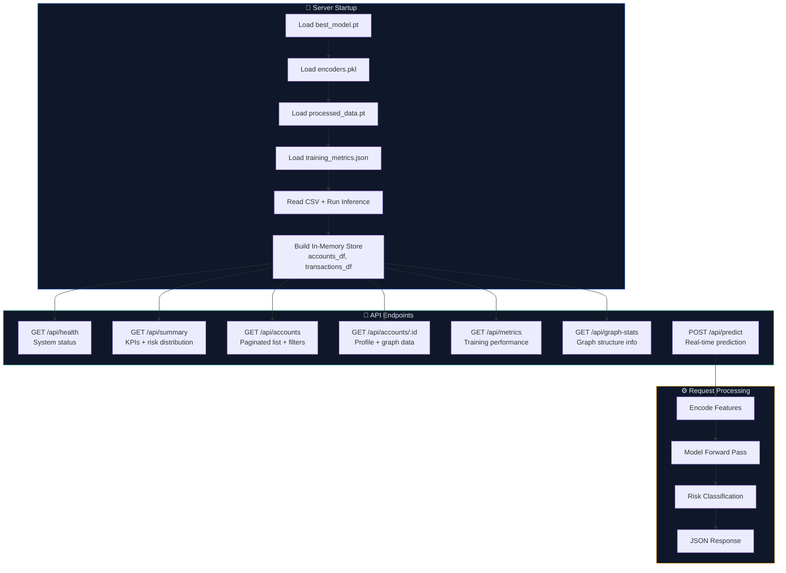
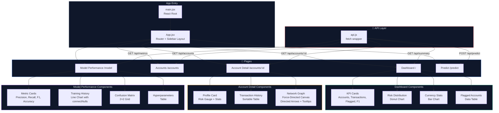

# 🛡️ AML Guard — Anti-Money Laundering Detection System

> Graph Attention Network (GAT) based detection system for identifying suspicious financial transactions, with a real-time monitoring dashboard.

---

## 📋 Table of Contents

- [Overview](#overview)
- [Architecture](#architecture)
- [Tech Stack](#tech-stack)
- [Project Structure](#project-structure)
- [Dataset](#dataset)
- [Pipeline](#pipeline)
  - [Step 1 — Data Preprocessing &amp; Graph Construction](#step-1--data-preprocessing--graph-construction)
  - [Step 2 — Model Architecture](#step-2--model-architecture)
  - [Step 3 — Training Pipeline](#step-3--training-pipeline)
  - [Step 4 — API Server](#step-4--api-server)
  - [Step 5 — Frontend Dashboard](#step-5--frontend-dashboard)
- [API Reference](#api-reference)
- [Model Performance](#model-performance)
- [Getting Started](#getting-started)
- [Risk Classification](#risk-classification)

---

## Overview

AML Guard is an end-to-end machine learning system that detects money laundering activity in financial transaction networks. It models transactions as a directed graph and applies a **Graph Attention Network (GAT)** to classify edges (transactions) as legitimate or suspicious.

### Key Features

- **Graph-based detection** — Transactions modeled as edges in a directed graph, capturing complex network patterns
- **Edge-level classification** — Each transaction is individually scored for laundering risk
- **4-tier risk scoring** — Low / Moderate / High / Critical categorization
- **Real-time prediction** — FastAPI endpoint for instant risk assessment of new transactions
- **Interactive dashboard** — React frontend with data visualization, account investigation, and network graph explorer
- **Synthetic AML patterns** — Data augmentation with 4 realistic laundering patterns (Smurfing, Round-Tripping, Cross-Border Layering, Fan-Out/Fan-In)

---

## Architecture

```
┌─────────────────────────────────────────────────────────────────────────────┐
│                            AML Guard System                                 │
├───────────────┬──────────────────────────┬──────────────────────────────────┤
│   DATA LAYER  │     ML PIPELINE          │      APPLICATION LAYER           │
├───────────────┼──────────────────────────┼──────────────────────────────────┤
│               │                          │                                  │
│  SAML-D.csv   │  data_pipeline.py        │  main.py (FastAPI)               │
│  (107MB,      │  ├─ Load & Clean         │  ├─ /api/predict                 │
│   152K+ txns) │  ├─ Encode Features      │  ├─ /api/accounts                │
│               │  ├─ Build Node Feats     │  ├─ /api/summary                 │
│  augment_     │  └─ Construct Graph      │  ├─ /api/metrics                 │
│  data.py      │                          │  └─ /api/graph-stats             │
│  (Synthetic   │  model.py                │           │                      │
│   patterns)   │  ├─ EdgeGATModel         │           ▼                      │
│               │  └─ FocalLoss            │  ┌──────────────────┐            │
│               │                          │  │   MongoDB         │            │
│               │  train.py ──────────────►│  │  ├─ transactions  │            │
│               │  ├─ AMP Training         │  │  ├─ accounts      │            │
│               │  ├─ Balanced Sampling    │  │  ├─ metrics        │            │
│               │  ├─ Threshold Tuning     │  │  └─ predictions    │            │
│               │  └─ Populate MongoDB     │  └──────────────────┘            │
│               │                          │           │                      │
│               │                          │  frontend/ (React+Vite)          │
│               │                          │  ├─ Dashboard                    │
│               │                          │  ├─ Accounts                     │
│               │                          │  ├─ Account Detail               │
│               │                          │  ├─ Model Performance            │
│               │                          │  └─ Predict                      │
└───────────────┴──────────────────────────┴──────────────────────────────────┘
```

### Flow Diagrams

#### 1. End-to-End System Flow



#### 2. Model Architecture Flow



#### 3. Backend API Flow



#### 4. Frontend Dashboard Flow



---

## Tech Stack

| Layer                   | Technology                    | Purpose                                           |
| ----------------------- | ----------------------------- | ------------------------------------------------- |
| **ML Framework**  | PyTorch + PyTorch Geometric   | Graph neural network training & inference         |
| **Model**         | GAT (Graph Attention Network) | Edge-level binary classification                  |
| **Loss Function** | Focal Loss (α=0.9, γ=2.0)   | Handling extreme class imbalance (~0.5% positive) |
| **Database**      | MongoDB (pymongo + motor)     | Persistent storage for accounts, transactions     |
| **Backend**       | FastAPI + Uvicorn             | REST API serving predictions & data               |
| **Frontend**      | React 18 + Vite               | Interactive monitoring dashboard                  |
| **Charts**        | Recharts                      | Training history, risk distribution charts        |
| **Styling**       | Vanilla CSS (Glassmorphism)   | Dark theme with frosted glass cards               |
| **Data**          | Pandas + NumPy                | Data processing                                   |

---

## Project Structure

```
money-laundering-detection/
│
├── backend/                      # Python package — all backend logic
│   ├── __init__.py
│   ├── main.py                   # FastAPI REST API server
│   ├── database.py               # MongoDB connection (sync + async)
│   ├── config.py                 # Centralized paths & hyperparameters
│   ├── ml/                       # Machine learning components
│   │   ├── __init__.py
│   │   ├── model.py              # EdgeGATModel + FocalLoss
│   │   ├── train.py              # Training & evaluation pipeline
│   │   └── data_pipeline.py      # CSV → PyG graph construction
│   └── scripts/                  # Utility scripts
│       ├── augment_data.py       # Synthetic laundering injection
│       ├── seed_db.py            # (Legacy) DB seeder
│       └── explore_data.py       # Data verification
│
├── data/                         # Data & model artifacts
│   ├── SAML-D.csv                # Transaction dataset (107MB, 152K+ rows)
│   ├── processed_data.pt         # PyTorch Geometric graph object
│   ├── best_model.pt             # Trained EdgeGATModel weights
│   ├── encoders.pkl              # Fitted LabelEncoders
│   └── training_metrics.json     # Training history & test performance
│
├── frontend/                     # React dashboard (Vite + Recharts)
│   ├── src/
│   │   ├── main.jsx              # React entry point
│   │   ├── App.jsx               # Router + sidebar layout
│   │   ├── api.js                # API client functions
│   │   ├── index.css             # Design system (tokens + components)
│   │   └── pages/
│   │       ├── Dashboard.jsx     # KPIs, risk donut, currency bars
│   │       ├── Accounts.jsx      # Filterable & paginated account list
│   │       ├── AccountDetail.jsx # Profile, transactions, network graph
│   │       ├── ModelPerformance.jsx  # Metrics, training chart
│   │       └── Predict.jsx       # Transaction risk prediction form
│   ├── package.json
│   └── vite.config.js
│
├── docker/                       # Deployment configuration
│   ├── Dockerfile.backend
│   ├── Dockerfile.frontend
│   └── nginx.conf
│
├── docs/                         # Documentation & media
│   ├── FLOW.md                   # System flow diagrams
│   ├── screenshots/              # Training screenshots
│   └── mockups/                  # UI mockups
│
├── docker-compose.yml            # Container orchestration
├── requirements.txt              # Python dependencies
├── README.md                     # This file
└── .gitignore
```

---

## Dataset

### SAML-D (Synthetic Anti-Money Laundering Dataset)

| Property                 | Value                          |
| ------------------------ | ------------------------------ |
| **Rows**           | ~152,000+ transactions         |
| **File Size**      | ~107 MB                        |
| **Positive Class** | ~0.5% (Is_laundering = 1)      |
| **Time Span**      | Multi-year transaction history |

### Columns

| Column                     | Type   | Description                                         |
| -------------------------- | ------ | --------------------------------------------------- |
| `Date`                   | string | Transaction date (YYYY-MM-DD)                       |
| `Time`                   | string | Transaction time (HH:MM:SS)                         |
| `Sender_account`         | string | Source account ID                                   |
| `Receiver_account`       | string | Destination account ID                              |
| `Amount`                 | float  | Transaction amount                                  |
| `Payment_currency`       | string | Currency used for payment                           |
| `Received_currency`      | string | Currency received                                   |
| `Sender_bank_location`   | string | Country of sender's bank                            |
| `Receiver_bank_location` | string | Country of receiver's bank                          |
| `Payment_type`           | string | Payment method (Wire, Cash, etc.)                   |
| `Is_laundering`          | int    | Ground truth label (0 = legitimate, 1 = laundering) |

### Augmented Patterns (`augment_data.py`)

4 synthetic money laundering patterns are injected into the dataset:

| Pattern                         | Description                                           | Characteristics                                    |
| ------------------------------- | ----------------------------------------------------- | -------------------------------------------------- |
| **Smurfing**              | Many small rapid transactions to different recipients | < detection threshold, 1-3 min window              |
| **Round-Tripping**        | A → B → C → D → A circular flow                   | High amounts, cross-border, funds return to origin |
| **Cross-Border Layering** | Funds hop through multiple countries                  | Currency conversions, shell jurisdictions          |
| **Fan-Out/Fan-In**        | One → many intermediaries → one collector           | Dispersion then aggregation                        |

---

## Pipeline

### Step 1 — Data Preprocessing & Graph Construction

**File:** `backend/ml/data_pipeline.py`

```
CSV (152K rows) → Clean → Encode → Build Graph → PyG Data Object
```

**Process:**

1. **Load & Clean** — Parse `Date` + `Time` → datetime, drop incomplete rows, sort chronologically
2. **Encode Categoricals** — LabelEncoder for 5 categorical columns (`Payment_currency`, `Received_currency`, `Sender_bank_location`, `Receiver_bank_location`, `Payment_type`)
3. **Temporal Edge Weights** — `weight = Amount / (Δt_minutes + 1)` — emphasizes recent high-value transactions
4. **Node Features** (7 dimensions per account):
   - `total_sent` — Total amount sent
   - `total_received` — Total amount received
   - `tx_count_sent` — Number of outgoing transactions
   - `tx_count_received` — Number of incoming transactions
   - `unique_partners` — Count of distinct counterparties
   - `foreign_currency_ratio` — Fraction of transactions with currency mismatch
   - `cross_border_ratio` — Fraction of cross-border transactions
5. **Edge Features** (8 dimensions per transaction):
   - 5 encoded categoricals + amount + temporal weight + is_laundering label
6. **Build PyG Data** — `torch_geometric.data.Data` with train/val/test masks (70/15/15 split)

**Output:** `data/processed_data.pt` (65MB), `data/encoders.pkl` (5.5MB)

```bash
python -m backend.ml.data_pipeline
```

---

### Step 2 — Model Architecture

**File:** `backend/ml/model.py`

#### EdgeGATModel

```
Node Features (7) ─→ GAT Layer 1 (4 heads × 64) ─→ GAT Layer 2 (1 head × 64) ─→ Node Embeddings (64)
                                                                                        │
Edge Features (8) ─→ Edge MLP (8 → 32) ─────────────────────────────────────────────────┤
                                                                                        │
                                                    ┌───────────────────────────────────┘
                                                    ▼
                                        [src_emb ‖ dst_emb ‖ edge_feat]  (160-dim)
                                                    │
                                           Classifier MLP (160 → 64 → 32 → 1)
                                                    │
                                              sigmoid → P(laundering)
```

**Key Design Decisions:**

- **2-layer GAT encoder** with BatchNorm and ELU activation
- **Multi-head attention** (4 heads) in first layer for diverse feature extraction
- **Edge-aware classification** — combines source/destination node embeddings with edge features
- **Chunked edge processing** (200K edges/chunk) to control VRAM usage on consumer GPUs
- **Focal Loss** (`α=0.9, γ=2.0`) to aggressively focus on the rare positive class (~0.5%)

#### FocalLoss

Addresses extreme class imbalance (legitimate ≫ laundering):

```
FL(p_t) = -α_t · (1 - p_t)^γ · log(p_t)
```

- `α = 0.9` → 90% weight on positive (laundering) class
- `γ = 2.0` → Down-weight easy negatives, focus on hard-to-classify samples

---

### Step 3 — Training Pipeline

**File:** `backend/ml/train.py`

**Optimized for:** RTX 3060 (6GB VRAM) + 16GB RAM

| Feature                         | Implementation                                   |
| ------------------------------- | ------------------------------------------------ |
| **Mixed Precision (AMP)** | `torch.amp.autocast` — ~40% VRAM reduction    |
| **Balanced Sampling**     | Oversample positive edges 3:1 per epoch          |
| **Cosine LR Schedule**    | With warm restarts (`T_0=20, T_mult=1`)        |
| **Threshold Tuning**      | Sweep 0.1–0.95 to maximize F1 on validation set |
| **Early Stopping**        | Patience = 15 epochs on validation F1            |

**Hyperparameters:**

| Parameter         | Value  |
| ----------------- | ------ |
| Learning Rate     | 0.0005 |
| Weight Decay      | 1e-5   |
| Hidden Dim        | 64     |
| Attention Heads   | 4      |
| Dropout           | 0.3    |
| Focal Alpha       | 0.9    |
| Focal Gamma       | 2.0    |
| Oversample Ratio  | 3.0    |
| Optimal Threshold | 0.90   |
| Epochs Trained    | 61     |

```bash
python -m backend.ml.train
```

**Output:** `data/best_model.pt` (144KB), `data/training_metrics.json` (21KB)

After training completes, `train.py` also **populates MongoDB** with:
- `transactions` — 152K+ documents with prediction scores
- `accounts` — 52K+ account profiles with risk scores
- `training_metrics` — Training results snapshot

---

### Step 4 — API Server

**File:** `backend/main.py`

FastAPI backend serving model predictions and data analysis endpoints. Reads all data from **MongoDB** (populated by `train.py`). On startup, it:

1. Loads the trained model (`data/best_model.pt`) — only for `/api/predict`
2. Loads label encoders (`data/encoders.pkl`) — only for `/api/predict`
3. Loads graph data (`data/processed_data.pt`) — only for `/api/graph-stats`
4. Connects to MongoDB — serves all GET endpoints from DB

```bash
python -m backend.main
# ✅ Server running at http://localhost:8000
# 📖 Swagger docs at http://localhost:8000/docs
```

---

### Step 5 — Frontend Dashboard

**Directory:** `frontend/`

React 18 + Vite single-page application with 5 pages:

| Page                        | Route             | Description                                                                                   |
| --------------------------- | ----------------- | --------------------------------------------------------------------------------------------- |
| **Dashboard**         | `/`             | KPI cards, risk distribution donut, top currencies, flagged accounts table                    |
| **Accounts**          | `/accounts`     | Searchable, filterable, paginated account list with risk badges                               |
| **Account Detail**    | `/accounts/:id` | Profile card, risk gauge, transaction history, directed network graph                         |
| **Model Performance** | `/model`        | Precision/Recall/F1/Accuracy cards, training history chart, confusion matrix, hyperparameters |
| **Predict**           | `/predict`      | Transaction input form with real-time risk prediction and factor breakdown                    |

**Design System:**

- **Theme:** Dark glassmorphism (`#0a0e1a` background, frosted glass cards)
- **Typography:** Inter (Google Fonts)
- **Icons:** Material Symbols (Google Fonts CDN)
- **Charts:** Recharts (PieChart, LineChart)
- **Network Graph:** Custom canvas-based force-directed layout with directed arrows

```bash
cd frontend
npm install
npm run dev
# Dashboard at http://localhost:5173
```

---

## API Reference

### `GET /api/health`

Health check endpoint.

**Response:**

```json
{
  "status": "healthy",
  "model_loaded": true,
  "database_connected": true,
  "accounts_count": 52463,
  "transactions_count": 152564
}
```

---

### `GET /api/summary`

Comprehensive overview of the dataset and model results.

**Response:**

```json
{
  "overview": {
    "total_accounts": 52463,
    "total_transactions": 152564,
    "class_distribution": { "normal": 151909, "laundering": 655 }
  },
  "risk_distribution": {
    "accounts": { "Low": 1200, "Moderate": 45000, "High": 5000, "Critical": 1263 },
    "transactions": { "Low": 2192, "Moderate": 142184, "High": 7531, "Critical": 657 }
  },
  "top_flagged_accounts": [...],
  "currency_stats": [...],
  "location_stats": [...],
  "payment_type_stats": [...],
  "model_metrics": { "best_epoch": 36, "test_metrics": {...}, "confusion_matrix": {...} }
}
```

---

### `GET /api/accounts`

Paginated account list with filtering and search.

**Parameters:**

| Param        | Type   | Default        | Description                                          |
| ------------ | ------ | -------------- | ---------------------------------------------------- |
| `category` | string | `null`       | Filter:`Low`, `Moderate`, `High`, `Critical` |
| `sort_by`  | string | `risk_score` | Sort field                                           |
| `order`    | string | `desc`       | `asc` or `desc`                                  |
| `page`     | int    | `1`          | Page number (1-indexed)                              |
| `limit`    | int    | `20`         | Results per page (max 100)                           |
| `search`   | string | `null`       | Search by account ID                                 |

**Response:**

```json
{
  "accounts": [
    {
      "account_id": "8724731955",
      "risk_score": 95.2,
      "risk_category": "Critical",
      "total_sent": 150000.50,
      "total_received": 89000.00,
      "unique_partners": 34,
      "cross_border_ratio": 0.85,
      "foreign_currency_ratio": 0.72
    }
  ],
  "total": 52463,
  "page": 1,
  "limit": 20,
  "total_pages": 2624,
  "category_counts": { "Low": 1200, "Moderate": 45000, "High": 5000, "Critical": 1263 }
}
```

---

### `GET /api/accounts/{account_id}`

Detailed account profile with transaction history and network graph data.

**Response:**

```json
{
  "account": {
    "account_id": "8724731955",
    "risk_score": 95.2,
    "risk_category": "Critical",
    "total_sent": 150000.50,
    "total_received": 89000.00,
    "unique_partners": 34
  },
  "transaction_summary": {
    "total_transactions": 67,
    "total_sent_count": 42,
    "total_received_count": 25,
    "flagged_transactions": 8
  },
  "transactions": [...],
  "graph": {
    "nodes": [
      { "id": "8724731955", "risk_category": "Critical", "is_center": true, ... }
    ],
    "edges": [
      {
        "source": "8724731955",
        "target": "2769355426",
        "amount": 5000.00,
        "risk_category": "High",
        "probability": 0.87,
        "payment_type": "Wire",
        "datetime": "2022-10-07T10:35:19"
      }
    ]
  }
}
```

---

### `GET /api/metrics`

Model training metrics and performance data.

**Response:**

```json
{
  "model_performance": {
    "best_epoch": 36,
    "best_val_f1": 0.025,
    "optimal_threshold": 0.90,
    "test_metrics": { "precision": 0.997, "recall": 0.826, "f1": 0.903, "loss": 0.021 },
    "confusion_matrix": { "tn": 151769, "fp": 2, "fn": 138, "tp": 655 },
    "risk_distribution": { "Low": 2192, "Moderate": 142184, "High": 7531, "Critical": 657 }
  },
  "hyperparameters": { "lr": 0.0005, "hidden_dim": 64, "num_heads": 4, ... },
  "training_history": [
    { "epoch": 1, "train_loss": 0.1206, "val_loss": 0.0187, "val_f1": 0.0022 },
    ...
  ]
}
```

---

### `GET /api/graph-stats`

Graph structure statistics.

**Response:**

```json
{
  "total_nodes": 52463,
  "total_edges": 152564,
  "avg_degree": 5.82,
  "density": 0.0001,
  "components": 1
}
```

---

### `POST /api/predict`

Predict laundering risk for new transactions.

**Request Body:**

```json
{
  "transactions": [
    {
      "Time": "10:35:19",
      "Date": "2022-10-07",
      "Sender_account": "8724731955",
      "Receiver_account": "2769355426",
      "Amount": 5000.00,
      "Payment_currency": "UK pounds",
      "Received_currency": "UK pounds",
      "Sender_bank_location": "UK",
      "Receiver_bank_location": "UK",
      "Payment_type": "Cash Deposit"
    }
  ]
}
```

**Response:**

```json
{
  "predictions": [
    {
      "sender": "8724731955",
      "receiver": "2769355426",
      "amount": 5000.00,
      "probability": 0.87,
      "risk_category": "High",
      "risk_score": 87.0,
      "details": {
        "payment_type": "Cash Deposit",
        "cross_border": false,
        "currency_mismatch": false
      }
    }
  ],
  "summary": {
    "total_analyzed": 1,
    "high_risk_count": 1,
    "average_risk": 0.87
  }
}
```

---

## Model Performance

### Test Set Results

| Metric                      | Value   |
| --------------------------- | ------- |
| **Precision**         | 99.70%  |
| **Recall**            | 82.60%  |
| **F1 Score**          | 0.9034  |
| **Best Epoch**        | 36 / 61 |
| **Optimal Threshold** | 0.90    |

### Confusion Matrix

|                           | Predicted Negative | Predicted Positive |
| ------------------------- | -----------------: | -----------------: |
| **Actual Negative** |       151,769 (TN) |             2 (FP) |
| **Actual Positive** |           138 (FN) |           655 (TP) |

### Risk Distribution (All Transactions)

| Category |   Count | Criteria         |
| -------- | ------: | ---------------- |
| Low      |   2,192 | P < 0.30         |
| Moderate | 142,184 | 0.30 ≤ P < 0.70 |
| High     |   7,531 | 0.70 ≤ P < 0.90 |
| Critical |     657 | P ≥ 0.90        |

---

## Getting Started

### Prerequisites

- **Python** 3.9+
- **Node.js** 18+ and npm
- **MongoDB** 5.0+ (remote or local)
- **CUDA** (optional, for GPU training)

### 1. Install Python Dependencies

```bash
pip install torch torchvision torch-geometric
pip install fastapi uvicorn pandas numpy scikit-learn joblib
pip install pymongo motor
```

### 2. Run the ML Pipeline (Optional — pre-trained model included)

```bash
# Step 1: Data augmentation (optional)
python -m backend.scripts.augment_data

# Step 2: Build graph from CSV
python -m backend.ml.data_pipeline

# Step 3: Train the model + populate MongoDB
python -m backend.ml.train
```

### 3. Start the API Server

```bash
python -m backend.main
# ✅ Server running at http://localhost:8000
# 📖 Swagger docs at http://localhost:8000/docs
```

### 4. Start the Frontend

```bash
cd frontend
npm install
npm run dev
# ✅ Dashboard at http://localhost:5173
```

### 5. Docker Deployment (Optional)

```bash
docker compose up -d --build
# MongoDB:  localhost:27017
# Backend:  localhost:8000
# Frontend: localhost:80
```

---

## Risk Classification

Transactions are classified into 4 risk tiers based on model prediction probability:

```
 ┌───────────┬───────────────────┬──────────────────────────────────────────┐
 │ Category  │ Probability Range │ Action                                    │
 ├───────────┼───────────────────┼──────────────────────────────────────────┤
 │ 🟢 Low    │ P < 0.30          │ No action required                       │
 │ 🟡 Moderate│ 0.30 ≤ P < 0.70  │ Monitor — flag for periodic review       │
 │ 🔴 High   │ 0.70 ≤ P < 0.90  │ Investigate — escalate to compliance     │
 │ ⛔ Critical│ P ≥ 0.90          │ Block — immediate SAR filing recommended │
 └───────────┴───────────────────┴──────────────────────────────────────────┘
```

---

## License

This project is for **academic and research purposes** as part of a seminar thesis on Anti-Money Laundering detection using Graph Neural Networks By Muhammad Syehan.

---

<div align="center">
  <sub>Built with PyTorch Geometric, FastAPI, and React</sub>
</div>
