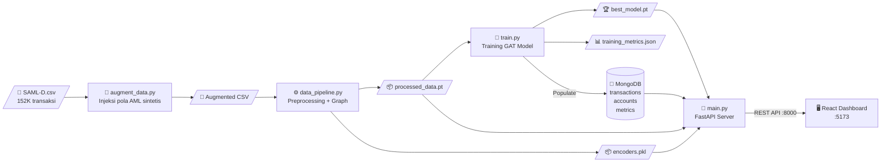
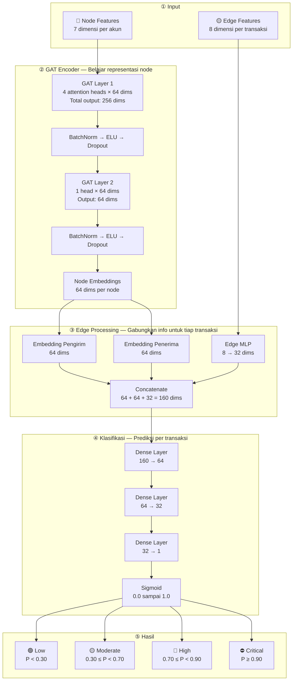
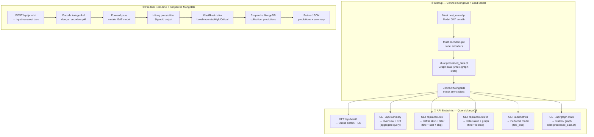
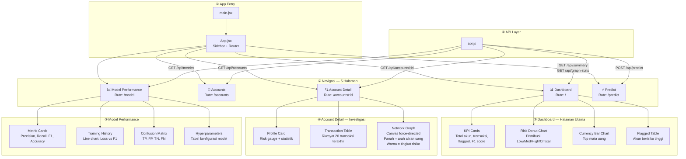

# 📊 AML Guard — System Flow Diagrams

Dokumen ini menjelaskan alur kerja sistem AML Guard secara visual menggunakan diagram.

---

## 1. 🔄 Keseluruhan Alur Sistem

Dari data mentah → model ML → API → dashboard:



### Penjelasan Alur:

| Langkah | File | Input | Output | Deskripsi |
|---------|------|-------|--------|-----------|
| 1 | `augment_data.py` | SAML-D.csv | Augmented CSV | Menambahkan pola laundering sintetis |
| 2 | `data_pipeline.py` | Augmented CSV | processed_data.pt, encoders.pkl | Membersihkan data, encode fitur, bangun graph |
| 3 | `train.py` | processed_data.pt | best_model.pt + **MongoDB** | Melatih model GAT, populate MongoDB |
| 4 | `main.py` | Model + MongoDB | REST API | Query MongoDB, serve API |
| 5 | `frontend/` | REST API | Dashboard | Menampilkan data secara visual |

---

## 2. 🧠 Alur Model (EdgeGATModel)

Bagaimana model GAT memproses data graph untuk mendeteksi transaksi mencurigakan:



### Node Features (7 dimensi per akun):

```
┌─────────────────────────────────────────────────────────────┐
│  1. total_sent           → Total uang dikirim               │
│  2. total_received       → Total uang diterima              │
│  3. tx_count_sent        → Jumlah transaksi keluar          │
│  4. tx_count_received    → Jumlah transaksi masuk           │
│  5. unique_partners      → Jumlah mitra unik                │
│  6. foreign_currency_ratio → Rasio transaksi valas          │
│  7. cross_border_ratio   → Rasio transaksi lintas negara    │
└─────────────────────────────────────────────────────────────┘
```

### Edge Features (8 dimensi per transaksi):

```
┌─────────────────────────────────────────────────────────────┐
│  1. Payment_currency     → Mata uang pembayaran (encoded)   │
│  2. Received_currency    → Mata uang diterima (encoded)     │
│  3. Sender_bank_location → Lokasi bank pengirim (encoded)   │
│  4. Receiver_bank_location → Lokasi bank penerima (encoded) │
│  5. Payment_type         → Jenis pembayaran (encoded)       │
│  6. Amount               → Jumlah transaksi                 │
│  7. Temporal_weight      → Amount / (Δt + 1)               │
│  8. Is_laundering        → Label ground truth               │
└─────────────────────────────────────────────────────────────┘
```

---

## 3. 🚀 Alur Backend (FastAPI)

Bagaimana server API memproses request:



### Contoh Alur Request:

```
Browser → GET /api/accounts/8724731955

  1. Server menerima request
  2. Query MongoDB: db.accounts.find_one({account_id: "8724731955"})
  3. Query MongoDB: db.transactions.find({sender/receiver: "8724731955"})
  4. Bangun graph data (nodes + edges) dari transaksi
  5. Return JSON: { account, transaction_summary, transactions, graph }

Browser ← JSON Response (< 100ms)
```

---

## 4. 🖥️ Alur Frontend (React Dashboard)

Bagaimana halaman frontend berinteraksi dengan API:



### Komponen Utama per Halaman:

```
Dashboard (/)
├── 4x KPI Cards          → Total akun, transaksi, flagged, F1 score
├── Donut Chart           → Distribusi risiko (Recharts PieChart)
├── Bar Chart             → Statistik mata uang (Recharts BarChart)
└── Flagged Table         → 10 akun paling berisiko

Accounts (/accounts)
├── Search Bar            → Cari berdasarkan Account ID
├── Category Filter       → Tab: All / Low / Moderate / High / Critical
├── Accounts Table        → Sortable, risk badges
└── Pagination            → 20 akun per halaman

Account Detail (/accounts/:id)
├── Profile Card          → Risk gauge (conic-gradient), sent/received stats
├── Transaction History   → Tabel dengan direction badges
└── Network Graph         → Canvas force-directed graph
    ├── Directed arrows   → Panah menunjukkan arah uang
    ├── Risk colors       → Merah/kuning/hijau berdasarkan risiko
    ├── Edge thickness    → Ketebalan ∝ jumlah transaksi
    └── Hover tooltips    → Detail saat mouse hover

Model Performance (/model)
├── 4x Metric Cards       → Precision, Recall, F1 Score, Accuracy
├── Training History       → Line chart (Loss + Val F1 per epoch)
├── Confusion Matrix       → 2×2 grid (TN, FP, FN, TP)
└── Hyperparameters Table  → lr, hidden_dim, heads, focal_alpha, dll.

Predict (/predict)
├── Transaction Form       → Input 10 field transaksi
├── Submit Button          → POST ke /api/predict
└── Result Card            → Probabilitas + risk category + faktor
```

---

## 5. 🔄 Alur Data End-to-End (Ringkasan)

```
    CSV File                  Graph Neural Network            MongoDB               REST API              Web Browser
    ────────                  ────────────────────            ───────               ────────              ───────────
    
    SAML-D.csv ──────────┐
    (152K transaksi)     │
                         ▼
                   ┌───────────────┐
                   │ augment_data  │ ← Injeksi 4 pola AML sintetis
                   └───────┬───────┘
                           ▼
                   ┌───────────────┐
                   │ data_pipeline │ ← Bersihkan, encode, bangun graph
                   └───────┬───────┘
                           │
                    ┌──────┴──────┐
                    ▼             ▼
             processed_data   encoders
                .pt             .pkl
                    │             │
                    ▼             │
              ┌──────────┐       │
              │  train   │       │
              │  (GAT)   │       │
              └────┬─────┘       │
                   │             │
             ┌─────┼─────┐      │
             ▼     │     ▼      │
        best_model │  metrics   │
          .pt      │   .json    │
             │     │     │      │
             │     ▼     │      │
             │  ┌──────────────────┐
             │  │    MongoDB       │ ← Persistent data store
             │  │  ├─ transactions │   (152K+ transaksi)
             │  │  ├─ accounts     │   (52K+ akun)
             │  │  ├─ metrics      │   (training results)
             │  │  └─ predictions  │   (real-time predictions)
             │  └────────┬─────────┘
             │           │         │
             └─────┬─────┘         │
                   ▼               ▼
            ┌─────────────────────┐
            │   FastAPI Server    │ ← Query MongoDB for GET endpoints
            │   (port 8000)       │   Model inference for POST /predict
            └─────────┬───────────┘
                      │ JSON
                      ▼
            ┌─────────────────────┐
            │   React Dashboard   │ ← 5 halaman interaktif
            │   (port 5173)       │
            └─────────────────────┘
```

---

<div align="center">
  <sub>AML Guard — Anti-Money Laundering Detection System</sub><br>
  <sub>Muhammad Syehan</sub>
</div>
